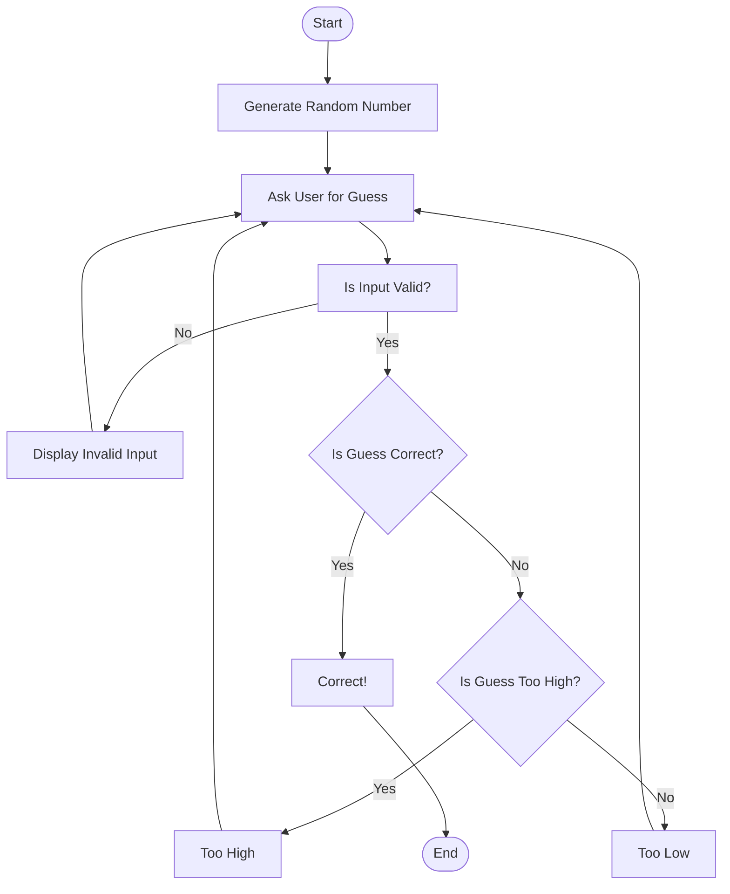

1. Start (A)
The game begins
2. Generate Random Number (B)
The computer generates a random number
3. Ask User for Guess (C)
The user enters a guess
4. Is Input Valid? (D)
The system checks the input, if its invalid step (E) is executed 
5. Is Guess Correct? (F)
The system checks the guess, if it's correct step (J) is executed 
6. Is Guess Too High? (G)
The system checks if the guess is too high, if yes the step (H) executed, if not the step (I)
7. End (K)
End the game
